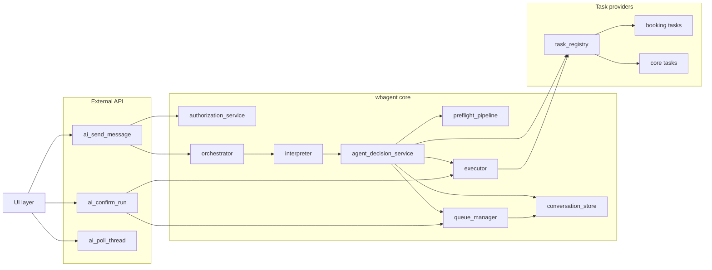

# WBAgent Runtime Overview

## Zweck

Diese Datei dokumentiert die Runtime-Komponenten auf Systemniveau.

## Komponenten

## Verbindliche Architekturregeln

- Mutating Entscheidungen gehen ueber preflight_pipeline.
- Queue-Status steuert Ausfuehrbarkeit fuer mutating items.
- Task-Versionpruefung ist Layer-1-Pflicht.
