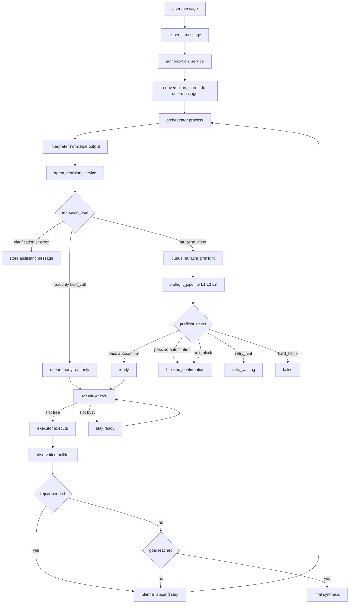

# WBAgent Workflow Uebersicht

## Zweck

Diese Datei beschreibt den aktuellen Soll-Workflow auf Architektur-Ebene.

Sie ist als Blueprint-Dokument eingeordnet, weil sie Runtime-Verantwortungen und Flussgrenzen beschreibt.

## Einordnung

- Runtime-Zielbild: PREFLIGHT_FINAL_TARGET_FOR_REVIEW
- Umsetzungsreihenfolge: PREFLIGHT_IMPLEMENTATION_AGENT_RUNBOOK

## End-to-End Flow (Soll)

## Richtlinien

- Einziger mutating Preflight-Einstieg ist preflight_pipeline.
- Queue ist Single Source of Truth fuer mutating lifecycle.
- Keine Legacy validate-Fallbacks.
- Keine Shadow-Mode-Pfade.
