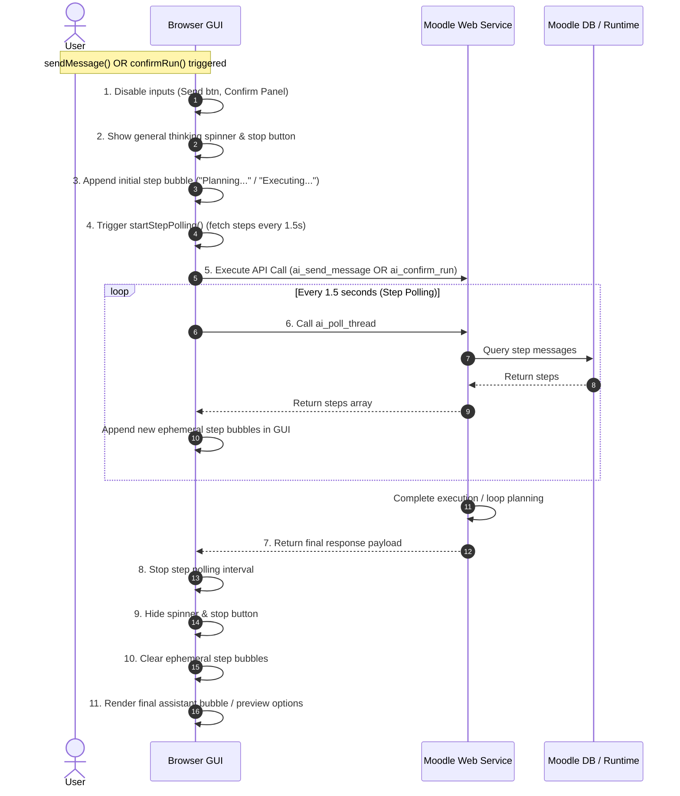

# Agentic Progress GUI Display Analysis: Ideal vs. Actual Behavior

This document presents a comprehensive analysis of how agentic progress is currently rendered in the `bookingextension_agent` user interface, highlights structural inconsistencies between the message sending and run confirmation flows, and identifies dead code.

---

## 1. GUI Progress Display: Overview of Flows

The agentic pipeline is triggered by two main user actions in the chat interface:
1. **`ai_send_message` (Message Sending):** Sent when the user types an instruction in the chat input and clicks "Send". This runs the LLM Orchestrator to plan actions.
2. **`ai_confirm_run` (Run Confirmation):** Sent when the user clicks "Confirm" on a proposed set of mutations to execute them.

Both processes run long-running backend agentic loops (`agent_runtime::run_loop()`) that process actions, hit LLM endpoints, run checks, and write intermediate **step-progress logs** (e.g., *Planning*, *Selection*, *Execution*) to the database.

---

## 2. Inconsistency Analysis: `ai_send_message` vs. `ai_confirm_run`

Currently, the GUI displays progress for these two workflows in completely different and inconsistent ways, which leads to a poor and confusing user experience.

### Comparison Table

| GUI progress Indicator | `ai_send_message` Flow | `ai_confirm_run` Flow | Ideal Unified Behavior |
| :--- | :--- | :--- | :--- |
| **Thinking Spinner (`#booking-ai-thinking`)** | ✅ **Active** (Updates label to "Privacy check running..." then default spinner) | ❌ **Inactive** (Hidden completely during execution) | ✅ **Active** (Updates label to "Executing..." or "Thinking...") |
| **"Stop" Button (`#booking-ai-btn-stop`)** | ✅ **Visible** (Allows user to cancel the running loop request) | ❌ **Hidden** (User cannot abort or interrupt execution) | ✅ **Visible** (Allows user to request aborting the queue items) |
| **Input Disabled** | ✅ **Yes** (Chat send button disabled) | ✅ **Yes** (Confirm panels hidden/disabled) | ✅ **Yes** (Inputs disabled during any active runner) |
| **Step-Progress Polling** | ✅ **Active** (Triggers `startStepPolling` immediately to load real-time step bubbles) | ❌ **Inactive** (Does not start polling during confirm call; only appends one static bubble) | ✅ **Active** (Starts `startStepPolling` to show execution progress in real-time) |
| **Cleanup on Response** | ✅ **Clears all** (Stops polling and wipes intermediate step bubbles) | ✅ **Clears all** (Stops polling and wipes intermediate step bubbles) | ✅ **Clears all** (Stops polling and wipes intermediate step bubbles) |

### Detailed Sequence Breakdown

#### 1. Message Sending (`sendMessage` in `aiinstructions.js`)
* User types text and submits.
* The frontend:
  1. Shows the thinking indicator: `#booking-ai-thinking` receives the privacy precheck label and is unhidden.
  2. Unhides `#booking-ai-btn-stop`.
  3. Disables the send button.
  4. Runs `ai_privacy_precheck`.
  5. If precheck is successful, it runs `startStepPolling(currentThreadId, currentContextId)` which runs a `setInterval` fetching new step logs from `ai_poll_thread` every 1.5 seconds.
  6. Appends an initial "Planning..." step bubble.
  7. Sends the AJAX call to `ai_send_message`.
  8. Once the response is received: stops polling, clears the ephemeral step bubbles, hides the spinner and stop buttons, and renders the final message.

#### 2. Confirm Run (`confirmRun` in `aiinstructions.js`)
* User clicks "Confirm".
* The frontend:
  1. Wipes any previous step bubbles.
  2. Appends a static "Executing..." step bubble.
  3. Hides the confirmation panel.
  4. Sends the AJAX call to `ai_confirm_run`.
  5. **Critical Gap:** No thinking spinner is shown, the "Stop" button is hidden, and **`startStepPolling` is never started**.
  6. Since the backend `confirm` method executes the commands and may transition into another orchestrator planner loop (which writes new step logs to the DB), **the user sees no updates**. They are stuck looking at a static "Executing..." bubble while the UI appears frozen.
  7. Once the response is received: it stops polling (even though it never started) and wipes the bubbles.

---

## 3. Ideal GUI Progress UX Architecture

To provide a consistent, cohesive, and premium user experience, both flows must display progress identically:



---

## 4. Dead and Unused Code Analysis

### A. Webservices (`classes/external/`)
* **`ai_list_candidate_options` (Dead):** 
  * Class: `bookingextension_agent\external\ai_list_candidate_options`
  * Declared in: `db/services.php` under the key `bookingextension_agent_ai_list_candidate_options`
  * **Findings:** This webservice is completely unused. A code-wide search shows zero references in any Javascript file, PHP file, or templates. The disambiguation logic is handled in-stream or via other option renders. This should be deleted along with its registration in `db/services.php`.

### B. JavaScript (`amd/src/aiinstructions.js`)
* **`shouldPreferRunStatus` logic (Redundant/Dead):**
  * Line 1298: `const shouldPreferRunStatus = source === 'ai_confirm_run'`
  * This parameter is checked in `handleConfirmationResponse()`, but wait—why should the GUI treat confirmation responses differently than message responses if both are returning the final loop state? Standardizing the return formats of both webservices makes this conditional branch redundant.
* **`resumeStepPolling` / `startStepPolling` overlap:**
  * Having both `resumeStepPolling` and `startStepPolling` is redundant. A single, solid `startStepPolling` function is sufficient.

### C. CSS/Styles (`styles.css`)
* There are several old selector styles for chat-bubbles (e.g. `.booking-ai-msg.user .bubble`) that are overridden by newer class selectors but still remain in the CSS file, cluttering layout definitions.

---

## 5. Implementation Roadmap for harmonizing the GUI

When code changes are approved, they should follow this execution plan:

1. **Update Central Flowchart (`AGENT_IMPLEMENTATION_FLOWCHART.mmd`):**
   * Update the runtime loop step box (`LOOP_STEP`) to document the dynamic logging of `next_step_intent` via `add_step_message` in the diagram.
2. **Unify frontend indicators in `confirmRun()`:**
   * Modify `confirmRun()` in `aiinstructions.js` to show the thinking spinner (`#booking-ai-thinking`), set the thinking label to an appropriate localized string (e.g. `Executing...`), show the stop button, and start step polling (`startStepPolling`).
3. **Implement Backend Step Logging in `run_loop()`:**
   * Modify `agent_runtime::run_loop()` to parse and write the current step's `next_step_intent` to the database using `$this->store->add_step_message($threadid, $step + 1, $intent, $task)`.
4. **Clean up dead code:**
   * Remove `bookingextension_agent_ai_list_candidate_options` registration from `db/services.php`.
   * Delete `classes/external/ai_list_candidate_options.php`.
5. **Recompile AMD assets:**
   * Run the scoped Grunt build tasks (`npx grunt --gruntfile Gruntfile.js amd` inside the subplugin directory) to compile the updated JS assets.

---

## 6. Dynamic Step Progress Logging (`next_step_intent`)

To display the specific actions the agent is performing at each step (rather than a generic, static "Thinking..." indicator), we can leverage the planner's `next_step_intent` output.

### Backend Mechanics
Inside `agent_runtime::run_loop()` at the end of each iteration:
1. The result of the step `$result` is retrieved from `run_internal()`.
2. Extract `next_step_intent` from `$result` (which the planner is required to output under the current prompt contracts).
3. Persist this intent as an ephemeral step message:
   ```php
   $intent = trim((string)($result['next_step_intent'] ?? ''));
   if ($intent !== '') {
       $this->store->add_step_message($threadid, $step + 1, $intent, $taskname);
   }
   ```

### Non-Blocking Concurrency via `write_close()`
Before entering the runtime loop, Moodle's session lock is closed using `\core\session\manager::write_close()`. Because the session file is not locked:
* The frontend can fire concurrent AJAX calls to `ai_poll_thread` every 1.5 seconds.
* `ai_poll_thread` runs concurrently and queries `local_wbagent_ai_messages` for the active thread.
* Each new step message inserted during the running loop is fetched instantly.

### Frontend Rendering
The AMD javascript `aiinstructions.js` (`startStepPolling()`) already fetches all messages, checks for `role === 'step'`, filter-checks against `lastSeenStepId`, and calls `appendStepBubble(msg.content, msg.id)`. It is fully prepared to render whatever string we insert in the backend.

---

## 7. Flowchart Integration Spec

The central flowchart at `docs/Blueprints/flowcharts/AGENT_IMPLEMENTATION_FLOWCHART.mmd` needs to be updated. Specifically:
* The loop step `LOOP_STEP` should include the dynamic DB insertion path.
* Visual arrow connections should show:
  `RUNINT -->|contains next_step_intent| DB_WRITE_STEP["store->add_step_message(next_step_intent)"]`
  `DB_WRITE_STEP -.->|read lock-free via poll| APO`

This ensures that our architecture documentation matches our best practice implementation.
