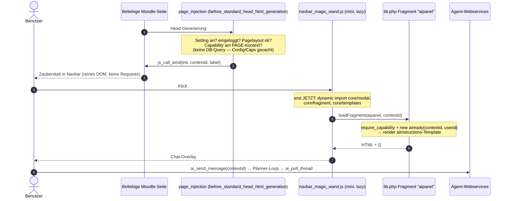

# Navbar-Integration (Zauberstab) & Kontext-Overlay — Blueprint & Umsetzungsstand

**Datum:** 2026-06-10
**Status:** **Revision 3 (konsolidiert, 2026-06-10 abends).** Revision 1 war die Machbarkeitsanalyse (gegen einen inzwischen veralteten Code-Stand geschrieben); Revision 2 korrigierte die Faktenbasis gegen HEAD; eine spätere Ergänzung („Kontext-Awareness", §5) hatte versehentlich die unkorrigierte Urfassung wiederhergestellt. Diese Revision konsolidiert beides: korrekte Fakten, klarer Umsetzungsstand, überarbeitetes Kontext-Awareness-Konzept.
**Ziel:** Den KI-Agenten (derzeit Subplugin `bookingextension_agent`) über einen „Zauberstab" in der Moodle-Navbar als Overlay auf jeder Seite im jeweiligen Kontext (Ambient Context) bereitzustellen.

---

## 0. Umsetzungsstand auf einen Blick

| Baustein | Status | Referenz |
|---|---|---|
| Backend context-agnostisch (Auth, Datenmodell, Runtime, Orchestrator, aiready) | ✅ ERLEDIGT | Konsolidierung P1–P4a, Commits `…`→`d93db9c` |
| Navbar-Feature (Setting, Hook, Injektions-Klasse, Fragment, Lazy-JS) | ✅ ERLEDIGT | Commit `4d6ca0b`, §4 |
| Kontext-Härtung (External-Layer-Shims, Typehints, CONTEXT_USER/COURSECAT) | ✅ ERLEDIGT | Commit `4d6ca0b`, §4.6 |
| Verfügbarkeitsschicht (`agent:ignoreaiavailability`-Bypass, Toggles nur für Nicht-Privilegierte) | ✅ ERLEDIGT (uncommitted, v2026061009) | `agent_permissions_concept_2026-06-10.md` §7 |
| **§5 Rich Context Awareness (Kontext-Block für Constructor/Synchronizer)** | ✅ ERLEDIGT (2026-06-10 spätabends, uncommitted) — **Benchmark-Lauf durch Georg ausstehend** | §5 |
| P4b-Produktfrage: Welche Skills sind außerhalb Booking *nützlich*? | ⚠️ Teilweise (Framework bereinigt via `3d76f05`; kontextgenerische Skills = Produktarbeit) | Konsolidierungs-Blueprints |
| Quota-/Kostenschicht (vor Teacher-/Studenten-Rollout) | ❌ OFFEN (Entscheidung O4) | Permissions-Konzept §6 |
| Umzug Hook+JS ins künftige `local_wbagent` | ❌ OFFEN (bewusste Übergangslösung im Subplugin) | `wbagent_local_plugin_extraction_plan_2026-06-08.md` |

---

## 1. Fazit (TL;DR)

Die ursprüngliche These „sind wir schon so weit?" ist beantwortet: **Ja — und es ist umgesetzt.** Die beiden Hürden der Erstanalyse sind Geschichte:

1. **Frontend-Laufzeit (Hürde 1): GELÖST** über Moodles Hook-System direkt aus dem Subplugin — Moodle scannt `db/hooks.php` aller Subplugins, ein separates local-Plugin war nicht nötig (§4.2/4.3).
2. **Backend-Gating (Hürde 2): GELÖST** durch die Kontext-Konsolidierung (P1–P4a) plus die Kontext-Härtung vom 2026-06-10 (§4.6). Das Backend ist vollständig context-agnostisch: MODULE / COURSE / COURSECAT / USER / SYSTEM.

**Einordnung:** Die Hook-Konstruktion im Subplugin ist eine bewusste **Übergangslösung** — nach der `local_wbagent`-Auskopplung wandern `db/hooks.php` und das Navbar-JS dorthin. Und weiterhin gilt: **„Stürzt nicht ab" ≠ „ist nützlich"** — welche Skills außerhalb eines Booking-Kontexts sinnvoll arbeiten, ist Produktarbeit (Skill-Tiers, siehe Permissions-Konzept) und Voraussetzung für eine Default-Aktivierung des Settings. Die Default-Einstellung bleibt deshalb **aus**.

---

## 2. Faktenanalyse (historisch, gegen HEAD verifiziert)

### 2.1 Warum die UI vorbereitet war
Die Frontend-Architektur war bereits kontext- statt modul-zentriert: `aiinstructions.js` und `aiinstructions.mustache` arbeiten durchgehend mit der `contextid` (verifiziert: kein cmid/bookingid im JS/Template); der Browser kennt den Seitenkontext via `M.cfg.contextid`.

### 2.2 Die ehemaligen Backend-Kopplungen — alle GELÖST

> Die Erstfassung dieses Abschnitts beschrieb den Code-Stand *vor* der Kontext-Konsolidierung und nannte u. a. eine Methode `require_booking_module_context()` und eine Spalte `threads.bookingid`, die es zu diesem Zeitpunkt bereits nicht mehr gab. Für die Nachwelt der tatsächliche Auflösungsweg:

1. **Berechtigungs-Gate:** `resolve_valid_context()` akzeptiert MODULE/COURSE/COURSECAT/USER/SYSTEM (USER = Dashboard, der Navbar-Hauptfall); `require_valid_context_for_levels()` liefert das `agent_context`-DTO. *(P1 + Härtung 2026-06-10)*
2. **Datenmodell:** `threads.bookingid` wurde komplett entfernt; `get_or_create_thread(userid, contextid)`. *(P3)*
3. **Runtime:** Der gesamte Planner-Loop trägt durchgehend `contextid`; `resolve_cmid_from_contextid()` existiert nicht mehr. *(P2/P2b/P2c)*
4. **Orchestrator-Promptblock:** `build_runtime_context_block` fällt außerhalb von Booking auf `$context->get_context_name()` zurück (Prompt-Key bleibt vorerst `booking_name:` — Prompt-Stabilität; Umbau siehe §5). *(2026-06-10)*
5. **Readiness:** `aiready` ist auf `(contextid, userid)`/`agent_context` umgebaut; Booking-Spezifisches (Modul-URLs, AI-Toggle-Fallback, Statistiken via duck-typed `booking_readiness_provider`) nur im Booking-Modul-Kontext, sonst neutrale Werte + generischer Welcome-String. Kurs-/Modul-Toggle-Zeilen erscheinen nur, wo es die Toggles gibt. *(P4a, 2026-06-10)*

---

## 3. Architektur (implementierter Fluss)



---

## 4. Umsetzung (✅ ERLEDIGT, Commit `4d6ca0b`) — inkl. Abweichungen vom Ursprungsplan

### 4.1 Admin-Setting
`bookingextension_agent/inject_in_navbar`, Checkbox, **Default 0**, Strings en/de. ✅

### 4.2 Hook-Registrierung
`db/hooks.php` → `core\hook\output\before_standard_head_html_generation` → `bookingextension_agent\local\hooks\page_injection::extend_head`. Subplugin-`db/hooks.php` wird von Moodle gescannt — bestätigt auf Moodle 5.1.1. ✅

### 4.3 Injektions-Klasse — mit drei bewussten Abweichungen vom Ursprungstext
1. **Capability am `$PAGE->context`, NICHT am System-Kontext.** Der Ursprungsplan hätte Teachern (Caps via Kurs-/Modul-Rollen) den Zauberstab versteckt.
2. **KEIN CSS-Inject.** Moodle aggregiert `styles.css` aller Plugins (Subplugins inkl.) ohnehin global ins Theme-Stylesheet; `$PAGE->requires->css()` im Head-Hook wäre zudem riskant.
3. **Lazy-Vorgabe (Georg):** Der Hook macht keine DB-Query (get_config = MUC, has_capability = request-gecachtes Accessdata), übergibt das Label aus PHP (kein String-AJAX im JS) und lädt nur das Mini-AMD-Modul. Pagelayout-Blacklist (embedded/popup/maintenance/…), alles in try/catch — die Seite bricht nie wegen des Einstiegspunkts. ✅

### 4.4 Frontend — Abweichungen vom Ursprungstext
* **`core/modal` statt `core/modal_factory`** (deprecated seit 4.3).
* **Panel via Fragment-Callback** (`bookingextension_agent_output_fragment_aipanel` in `lib.php`) serverseitig gerendert statt client-seitigem Template-Bau — das Fragment liefert HTML + `{{#js}}`, womit `aiinstructions.js` im Modal bootet (ermöglicht durch den Fragment-JS-Fix `c722bce`).
* **Null statische Imports** in `navbar_magic_wand.js`; Modal/Fragment/Templates per `await import(…)` erst beim ersten Klick; Modal wird gecacht.
* Selektor `#usernavigation` (vor dem User-Menü), Fallback `.navbar .navbar-nav` — **bekannte Einschränkung:** Boost-Familie; exotische Themes zeigen den Button ggf. nicht. ✅

### 4.5 Backend-Restkopplungen — ✅ ERLEDIGT
Die zwei letzten Punkte (Orchestrator-Kontextname, aiready/P4a) wurden am 2026-06-10 abends geschlossen, siehe §2.2 (4)+(5). **Achtung Nachwelt:** Frühere Fassungen dieses Schritts empfahlen `bookingid` nullable zu machen und `require_booking_module_context()` umzubenennen — beides beschrieb einen Code-Stand, den es nicht mehr gibt. `bookingid` ist **gelöscht**, nicht nullable; nicht wieder einführen.

### 4.6 Kontext-Härtung (Folgefehler des Live-Betriebs, ✅ ERLEDIGT)
Beim Live-Test vom Dashboard aufgedeckt und behoben (alle in `4d6ca0b`):
* `context_module`-Typehints in `orchestrator_routing_service` + 3 Orchestrator-Methoden → TypeError → fälschlich „alles rot" in der Readiness.
* Cores `is_ai_tools_enabled_in_course()` interpretiert jede Nicht-Kurs-instanceid als cmid → Kurs-Toggle jetzt über `get_course_context(false)` aufgelöst.
* 8 External-Endpoints hatten einen Modul-Kontext-Shim (contextid-als-cmid-Fallback!) → entfernt; ungeschützte `instanceid`-als-cmid-Zugriffe → geguardet (cmid=0 außerhalb Modul); `ws_message_formatter` nimmt jeden Kontext; `activate_trial_context` schaltet Toggles kontextabhängig.
* Erlaubte Kontextlevel um USER + COURSECAT erweitert (Dashboard!).

### 4.7 Verfügbarkeitsschicht (✅ ERLEDIGT, uncommitted, v2026061009)
`agent:ignoreaiavailability` (Default Manager, Admins implizit) überspringt Kurs-/CM-`enableaitools`; zentral in `get_runtime_provider_status`, Readiness und Entry-Points erben automatisch; Panel kennzeichnet übersprungene Toggles ehrlich. Details + Rollout Admin→Teacher→Student: [`agent_permissions_concept_2026-06-10.md`](agent_permissions_concept_2026-06-10.md).

---

## 5. Rich Context Awareness & Cache-Friendly Prompting — ✅ UMGESETZT (2026-06-10 spätabends)

> **Status: umgesetzt** in `orchestrator::build_runtime_context_block()` + neue Helper-Methode `append_moodle_context_section()` (gefüttert aus `agent_context` + `get_fast_modinfo`, try/catch-gekapselt); `now_iso` jetzt minutengenau. Selection/Discovery unverändert schlank; voller Block bei `PHASE_PARAMETER_CONSTRUCTION` und Synchronizer (erkannt am `synchronization`-Memory-Channel). `booking_name:`-Key unverändert (Behavior-Erhalt). Doku: architecture/05 §3 (neue Tabelle), architecture/12 §3, Flowchart-Legende `LG_RCTX`. **Offen: Benchmark-Vorher/Nachher-Lauf (Auflage 5.4.1) — nur serverseitig möglich.** Die vier Review-Korrekturen (Phasen-Namen, Caching-Argument, active_page_blocks gestrichen, agent_context als Datenquelle) sind eingearbeitet.

Ziel: Der Agent (v. a. Parameter-Constructor und Synchronizer) soll strukturiert wissen, *wo* er läuft — Kurs, Modul, Kontextlevel — damit Parameter ohne Rückfragen korrekt belegt und finale Antworten auf die Umgebung Bezug nehmen können.

### 5.1 Phasen-spezifische Injektion
Gesteuert über den bestehenden `build_runtime_context_block`-Mechanismus (analog zum Memory-Channel-Muster):

| Phase (Code-Name!) | Kontext-Block | Begründung |
|---|---|---|
| Discovery | schlank (wie heute) | kein LLM-Chat-Call |
| **PHASE_SELECTION** | **schlank** (nur Kontextname, kein ID-Block) | Der Selektor wählt Skills nach Intent; Kurs-IDs/Strukturen tragen nichts bei → Token-Ersparnis |
| **PHASE_PARAMETER_CONSTRUCTION** | **voll** | Der Constructor braucht IDs (courseid, cmid, instanceid), um Parameter ohne Clarification zu belegen |
| **Synchronizer** (`process_synchronizer` — es gibt KEINE „PHASE_SYNTHESIS") | **voll** | finale Antwort referenziert die Umgebung korrekt |

**Ehrlichkeit beim Caching-Argument:** Der statische System-Prompt-Präfix ist heute schon cache-stabil (Dynamik liegt bewusst in `[SYSTEM_RUNTIME]` am Ende). Der Gewinn der schlanken Selection ist primär **Token-Kosten**, nicht Cache. Der tatsächliche Cache-Brecher ist `now_iso` (sekundengenau, in jedem Request anders) → **auf Minuten-Granularität runden** und den Runtime-Block strikt hinter dem statischen Teil halten.

### 5.2 Cache-First-Datenquellen (keine zusätzliche DB-Last)
Kein neuer Auflösungscode — die Bausteine existieren:
1. **`agent_context`-DTO** (genau dafür gebaut): `id()`, `level()`, `display_name()`, lazy `cmid()`, `courseid()`, `modname()`. Kontext-Auflösung via `context::instance_by_id` = statischer Moodle-Cache.
2. **`get_fast_modinfo($courseid)`**: MUC-gecacht; liefert `cms[$cmid]` (Modulname, Instanz-ID, Sichtbarkeit) **und** den Kurs-Record (`->get_course()`) — ein separates `get_course()` (= potenzielle DB-Query) entfällt.
3. ~~`active_page_blocks`~~ — **gestrichen.** Ein WS-Call kennt die Blöcke der Ursprungsseite nicht; sie serverseitig zu ermitteln hieße `block_instances`-Queries (Widerspruch zum eigenen Ziel), und kein Skill konsumiert diese Information. Erst wieder aufnehmen, wenn ein konkreter Konsument existiert.

### 5.3 Struktur des Kontext-Blocks (`[SYSTEM_RUNTIME]`)
```yaml
moodle_context:
  context_id: 1332
  context_level: 70
  context_level_name: "Module"
  context_name: "Haupt-Buchung"        # ersetzt langfristig den booking_name-Key
  course:                               # nur wenn courseid() !== null
    id: 23
    fullname: "Mein Kurs"
    shortname: "MK-101"
  module:                               # nur wenn cmid() !== null
    cmid: 45
    modname: "booking"
    instance_id: 12
timezone: Europe/Vienna
now_iso: 2026-06-10T17:35+02:00         # minutengenau (Cache!)
```

### 5.4 Umsetzungsauflagen
1. **Prompt-Änderung = Benchmark-Pflicht.** Der heutige Block nutzt den Key `booking_name:`, auf den Prompts eingeschliffen sind. Vorher/Nachher-Lauf über die Benchmark-Infrastruktur, nicht blind umstellen.
2. Implementierungsort: `build_runtime_context_block` (orchestrator) bzw. ein kleiner Builder-Service, gefüttert ausschließlich aus `agent_context` + `get_fast_modinfo`.
3. Behavior-Erhalt für Booking: Im Booking-Modul-Kontext müssen Name/Inhalte semantisch identisch bleiben.
