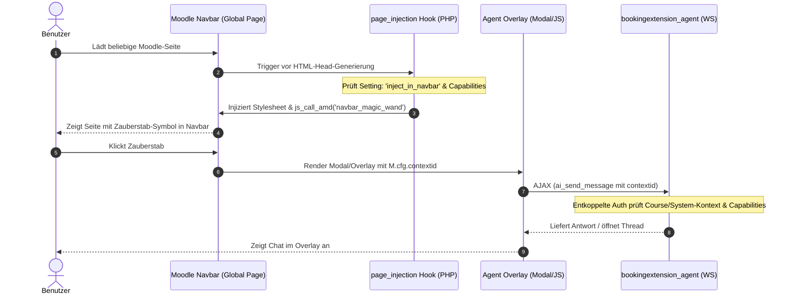

# Navbar-Integration (Zauberstab) & Kontext-Overlay — Machbarkeitsanalyse & Blueprint

**Datum:** 2026-06-10  
**Status:** Konzept & Blueprint — **Revision 2 (2026-06-10): gegen HEAD verifiziert.** Die ursprüngliche Fassung beschrieb den Code-Stand *vor* der Kontext-Konsolidierung (P1–P3, Branch `first-release`); „Hürde 2" ist inzwischen weitgehend gelöst. Abschnitte 1, 2.2, 4.3–4.5 und 5 entsprechend korrigiert.  
**Ziel:** Untersuchung der Machbarkeit, den aktuellen KI-Agenten (derzeit noch in `bookingextension_agent` verortet) über einen "Zauberstab" in der Moodle-Navbar als Overlay/Modal auf der jeweils aktuellen Seite und im jeweiligen Kontext (Ambient Context) global bereitzustellen.  
**Prüfung der These:** *„Sind wir schon so weit, dass wir den Booking wbagent kontextspezifisch in die Navbar auslagern können?“*

---

## 1. Fazit & Kernaussage (TL;DR)

Die Vermutung ist **weitgehend richtig** — näher am „Ja", als die Erstfassung dieses Dokuments annahm:

1. **Frontend-Laufzeit (Hürde 1, weiterhin gültig):** Da der Agent derzeit als Subplugin eines Aktivitätsmoduls (`bookingextension_agent`) registriert ist, wird sein JS-Code standardmäßig **nur auf Booking-Seiten** geladen. Auf Dashboard- (`/my/`), Kurs- oder Admin-Seiten läuft der Code gar nicht. Für eine globale Navbar-Einbindung wird ein globaler Einstiegspunkt benötigt — lösbar über Moodles Hook-System direkt aus dem Subplugin (siehe §4).
2. **Backend-Gating (Hürde 2, durch Konsolidierung P1–P3 weitgehend GELÖST):** Die Erstfassung beschrieb hier einen veralteten Code-Stand. Tatsächlich akzeptiert die Autorisierung bereits MODULE/COURSE/SYSTEM-Kontexte, `threads.bookingid` wurde komplett entfernt, und die Runtime trägt durchgehend `contextid`. **Tatsächlich noch offen sind nur zwei Restkopplungen:** der Booking-Namens-Lookup im Orchestrator-Promptblock und der `aiready`-Readiness-Check (= P4a des Konsolidierungsplans). Details in §2.2.

**Ergebnis:** Das Feature ist umsetzbar. Die Backend-Restkopplungen (Orchestrator-Kontextname, `aiready`/P4a) wurden am 2026-06-10 abends geschlossen — **das Backend ist damit vollständig context-agnostisch**; es fehlt nur noch das globale Einbindungskonzept (Moodle-Hooks + Admin-Setting, §4.1–4.4), solange der Code im Subplugin verbleibt. **Einordnung in die Roadmap:** Die Hook-Konstruktion im Subplugin ist eine bewusste **Übergangslösung** — nach der geplanten Auskopplung in ein `local_wbagent`-Plugin (siehe `wbagent_local_plugin_extraction_plan_2026-06-08.md`) wandern `db/hooks.php` und das Navbar-JS natürlich dorthin. Außerdem gilt: **„Stürzt nicht ab" ≠ „ist nützlich"** — welche Skills außerhalb eines Booking-Kontexts sinnvoll arbeiten (Framework-Skillnamen, P4b), ist eine eigene Produktfrage und Voraussetzung für eine Default-Aktivierung des Settings.

---

## 2. Detaillierte Faktenanalyse

### 2.1 Warum die UI bereits gut vorbereitet ist
Die Frontend-Architektur des Agenten ist erfreulicherweise bereits **kontext- und nicht Modul-zentriert**:
* **Übergabe der `contextid`:** Die AJAX-Aufrufe in [aiinstructions.js](file:///var/www/moodle/public/mod/booking/bookingextension/agent/amd/src/aiinstructions.js) und das Rendering in [aiinstructions.mustache](file:///var/www/moodle/public/mod/booking/bookingextension/agent/templates/aiinstructions.mustache) nutzen konsequent die `contextid`.
* **Erfassung des aktiven Kontexts:** Im Browser kann die ID der aktuellen Seite in Moodle sehr leicht aus dem globalen JavaScript-Konfigurationsobjekt via `M.cfg.contextid` ausgelesen werden. Der Client weiß also auf jeder Seite (Kurs, Dashboard, Forum etc.) sofort, in welchem Kontext er sich befindet.

---

### 2.2 Die Hürden im Detail

#### Hürde A: Moodle-Lade-Lifecycle (Kein globaler Code im Subplugin)
Moodle lädt Plugins des Typs `mod_booking` und deren Subplugins (`bookingextension`) nur dann, wenn eine Seite der jeweiligen Aktivität aufgerufen wird. 
* Wenn ein Benutzer sich auf `/my/` (Dashboard) oder `/course/view.php?id=3` befindet, werden die PHP- und JS-Dateien von `bookingextension_agent` **nie geladen**.
* Ein `bookingextension`-Subplugin kann somit **keinen globalen Hook** wie `*_extend_navigation` oder globale JavaScript-Injektionen ausführen.
* **Lösung für den Verbleib in der Bookingextension:** Wir nutzen Moodles Hook-System. Da Moodle alle installierten Subplugins auf `db/hooks.php` scannt, können wir globale Seitengenerierungshooks abfangen, um CSS/JS bedingt zu injecten.

#### Hürde B: Backend-Kopplungen — Stand nach Konsolidierung P1–P3 (gegen HEAD verifiziert, 2026-06-10)

Die Erstfassung dieses Abschnitts beschrieb den Code-Stand **vor** der Kontext-Konsolidierung. Tatsächlicher Stand:

1. **Berechtigungs-Gate: BEREITS GELÖST.**  
   `require_booking_module_context()` existiert nicht mehr. `resolve_valid_context()` in [authorization_service.php](file:///var/www/moodle/public/mod/booking/bookingextension/agent/classes/local/wbagent/services/security/authorization_service.php#L69-L76) akzeptiert bereits `CONTEXT_MODULE`, `CONTEXT_COURSE` und `CONTEXT_SYSTEM`; `require_valid_context_for_levels()` (Z. 137) liefert direkt ein `agent_context`-DTO.
2. **Datenmodell: BEREITS GELÖST.**  
   Die Spalte `bookingid` wurde in P3 **komplett aus `local_wbagent_ai_threads` entfernt** (kein Upgrade nötig, Plugin nicht produktiv). `get_or_create_thread()` / `create_fresh_thread()` in conversation_store.php arbeiten mit `(int $userid, int $contextid)`.
3. **Runtime: BEREITS GELÖST.**  
   `resolve_cmid_from_contextid()` existiert nicht mehr; der gesamte Planner-Loop (agent_runtime → orchestrator → decision → executor) trägt durchgehend `contextid` (P2/P2b/P2c).
4. **Orchestrator-Promptblock: GELÖST (2026-06-10 abends).**  
   `build_runtime_context_block` nutzt für Nicht-Booking-Kontexte jetzt `$blockcontext->get_context_name()` als Fallback; Booking-Modul-Kontexte behalten verhaltensgleich den Booking-Instanznamen. (Prompt-Key heißt weiterhin `booking_name:` — Umbenennung zu `context_name:` bewusst zurückgestellt wegen Prompt-Stabilität.)
5. **Readiness-Check: GELÖST (2026-06-10 abends, = P4a).**  
   [aiready.php](file:///var/www/moodle/public/mod/booking/bookingextension/agent/classes/local/wbagent/aiready.php) ist auf `agent_context` umgebaut: Constructor `(int $contextid, int $userid)`, Modul-URLs/AI-Toggle/Statistiken nur bei Booking-Modul-Kontext, sonst neutrale Werte + generischer Welcome-String (`ai_welcome_generic`). Booking-Statistiken kommen via duck-typed `mod_booking\…\booking_readiness_provider`. Cross-Repo-Caller `mod/booking/view.php` angepasst (`new aiready($context->id, $USER->id)`).

---

## 3. Architektur & Implementierungsplan für das Navbar-Overlay

Um den Zauberstab kontextspezifisch in die Navbar zu bringen, während der Agent im Subplugin bleibt, schlagen wir folgendes Vorgehen vor:



---

## 4. Konkrete Planungsschritte & Technische Umsetzung (Anmerkungen)

> **✅ UMGESETZT (2026-06-10):** Schritte 1–4 sind implementiert — mit zwei Abweichungen
> gegenüber dem ursprünglichen Text: (a) Das Panel wird **nicht** client-seitig aus dem
> Template gebaut, sondern über einen **Fragment-Callback**
> (`bookingextension_agent_output_fragment_aipanel` in `lib.php`) serverseitig gerendert
> und beim Klick in ein `core/modal` geladen. (b) **Lazy-Loading-Vorgabe (Georg):** Die
> Navbar-Injektion muss auf jeder Seite minimal sein — der Hook macht keine DB-Abfrage
> (Config/Capability sind request-gecacht), `navbar_magic_wand.js` hat **keine statischen
> Imports** und macht **kein String-AJAX** (Label kommt als Parameter aus PHP); Modal,
> Templates, Fragment und das aiready-Panel laden ausschließlich per Dynamic Import beim
> ersten Klick.

### 4.1 Schritt 1: Admin-Setting hinzufügen
Wir fügen eine neue Einstellungsoption in [settings.php](file:///var/www/moodle/public/mod/booking/bookingextension/agent/settings.php) hinzu, um die Navbar-Injektion ein- und ausschaltbar zu machen.

* **Einstellungsschlüssel:** `bookingextension_agent/inject_in_navbar`
* **Typ:** Checkbox (`admin_setting_configcheckbox`)
* **Standardwert:** `0` (deaktiviert)
* **Sprachstrings (`lang/de/bookingextension_agent.php` und `lang/en/bookingextension_agent.php`):**
  * `inject_in_navbar`: "Zauberstab in der Navbar anzeigen" / "Show Magic Wand in Navbar"
  * `inject_in_navbar_desc`: "Injiziert das Zauberstab-Symbol und die erforderlichen Stylesheets global auf allen Moodle-Seiten." / "Injects the magic wand icon and required stylesheets globally on all Moodle pages."

### 4.2 Schritt 2: Globalen Hook registrieren (`db/hooks.php`)
Wir legen die Datei `public/mod/booking/bookingextension/agent/db/hooks.php` neu an:
```php
<?php
defined('MOODLE_INTERNAL') || die();

$callbacks = [
    [
        'hook' => \core\hook\output\before_standard_head_html_generation::class,
        'callback' => \bookingextension_agent\local\hooks\page_injection::class . '::extend_head',
    ],
];
```

### 4.3 Schritt 3: Injektions-Klasse erstellen
Wir legen die Klasse `bookingextension_agent\local\hooks\page_injection` in `public/mod/booking/bookingextension/agent/classes/local/hooks/page_injection.php` an:
```php
<?php
namespace bookingextension_agent\local\hooks;

defined('MOODLE_INTERNAL') || die();

class page_injection {
    /**
     * Injiziert CSS und das Zauberstab-JavaScript in den HTML-Head.
     */
    public static function extend_head(\core\hook\output\before_standard_head_html_generation $hook): void {
        global $PAGE, $USER;

        // 1. Prüfen, ob das Setting aktiviert ist.
        if (empty(get_config('bookingextension_agent', 'inject_in_navbar'))) {
            return;
        }

        // 2. Prüfen, ob der User eingeloggt ist (keine Gäste/anonymen Zugriffe).
        if (!isloggedin() || isguestuser()) {
            return;
        }

        // 3. Berechtigungsprüfung: Darf der Nutzer den Agenten nutzen?
        // WICHTIG: am PAGE-Kontext prüfen, NICHT am System-Kontext. Trainer/Manager
        // halten die Capability typischerweise über Kurs-/Modul-Rollen; ein Check am
        // System-Kontext würde den Zauberstab genau diesen Nutzern verstecken.
        // (Die autoritative Prüfung macht ohnehin das Backend-Gate bei jedem WS-Call.)
        if (!has_capability('bookingextension/agent:useaiinstructions', $PAGE->context)) {
            return;
        }

        // 4. KEIN CSS-Inject nötig: Moodle aggregiert styles.css aller installierten
        // Plugins (Subplugins eingeschlossen) automatisch ins Theme-Stylesheet jeder
        // Seite. $PAGE->requires->css() wäre im Head-Hook zudem riskant
        // (coding_exception, wenn der Head bereits generiert wird).

        // 5. JavaScript laden und mit der aktuellen contextid initialisieren.
        $PAGE->requires->js_call_amd('bookingextension_agent/navbar_magic_wand', 'init', [
            'contextid' => $PAGE->context->id
        ]);
    }
}
```

### 4.4 Schritt 4: Frontend-Skript für den Zauberstab (`amd/src/navbar_magic_wand.js`)
Das JavaScript-Modul sucht das Navbar-Element und baut die Overlay-UI auf:
* **DOM-Injektion:** Das Skript sucht den Selektor `.navbar-nav` (Boost Theme) oder das User-Menü und fügt ein Listen-Element mit dem Zauberstab-Button (SVG) hinzu. **Bekannte Einschränkung:** Der Selektor ist theme-abhängig (Boost-Familie); für Fremd-Themes braucht es einen Fallback (z. B. Anhängen an `#page-header` oder schwebender Button).
* **Modal-Verhalten:** Bei Klick wird ein modales Overlay oder eine schwebende Sidebar geladen — über die **`core/modal`-Klassen** (z. B. eigene Modal-Subklasse oder `ModalCancel`); `core/modal_factory` ist seit Moodle 4.3 deprecated und darf auf 5.1 nicht mehr neu verwendet werden.
* **Template-Laden:** Das Template `bookingextension_agent/aiinstructions` wird mit der aktuellen `contextid` (aus `M.cfg.contextid` oder dem Hook-Parameter) gerendert.
* **Initialisierung:** Das bereits vorhandene `aiinstructions.js` wird aufgerufen, um das Senden/Empfangen von Nachrichten zu verwalten.

### 4.5 Schritt 5: Verbleibende Backend-Restkopplungen schließen

> **⚠️ Revision 2:** Die ursprünglichen Punkte 1–3 dieses Schritts (Autorisierung verallgemeinern, `bookingid` nullable, `resolve_cmid_from_contextid` → null) sind durch die Kontext-Konsolidierung P1–P3 **bereits umgesetzt — und zwar sauberer** (`agent_context`-DTO, `bookingid` komplett entfernt statt nullable). Sie dürfen NICHT wie ursprünglich beschrieben implementiert werden; insbesondere würde ein `bookingid NOTNULL="false"` in `install.xml` eine bewusst gelöschte Spalte wieder einführen.

**Stand 2026-06-10 abends: Punkte 1 und 2 sind UMGESETZT** (siehe §2.2, Punkte 4 und 5). P4b (Framework-Skillnamen) wurde durch Commit `3d76f05` („get rid of old booking references") im Wesentlichen erledigt: `option_lookup_service`, Option-/Entity-Mutation-Services, alte externe WS-Klassen und Option-DTOs sind gelöscht; hardcodierte `mod_booking.*`-Skillnamen kommen im Framework nicht mehr vor.

**Bewusst verbleibende Booking-Bezüge** (kein Handlungsbedarf für die Navbar):

1. `classes/agent.php` extends `mod_booking\plugininfo\bookingextension` — strukturell, solange der Agent ein Booking-Subplugin ist; löst sich erst mit der `local_wbagent`-Auskopplung.
2. `docs_corpus_registry::FALLBACK_ADMIN_CORPUS_ID = 'mod_booking'` — dokumentierte Back-Compat für bereits indizierte Embeddings.
3. `skill_contract_validator::RESERVED_NAMESPACES = ['booking', 'core']` und das Lang-Component-Mapping in `result_payload_summarizer` — Governance/Back-Compat, booking-agnostisch im Verhalten.
4. Benchmark-Szenarien unter `benchmark/scenarios/` — bewusst booking-spezifische Testdaten.
5. Duck-typed Provider-Klassennamen (z. B. `booking_readiness_provider` in `aiready`) — das gewollte Inversionsmuster, kein Compile-Time-Zwang.

---

## 5. Fazit zur Machbarkeit

Durch die Nutzung von Moodles Hook-System (`before_standard_head_html_generation`, von Subplugin-`db/hooks.php` aus registrierbar; verifiziert auf Moodle 5.1.1) können wir die Injektion des Zauberstabs **vollständig autark im Subplugin** implementieren — als bewusste Übergangslösung bis zur `local_wbagent`-Auskopplung, wohin Hook und Navbar-JS dann wandern. Das Backend-Fundament steht durch die Kontext-Konsolidierung bereits: Auth, Datenmodell und Runtime sind context-agnostisch. Offen sind nur die zwei Restkopplungen aus §4.5 (Orchestrator-Kontextname, `aiready`/P4a) für den crash-freien Betrieb sowie P4b (Framework-Skillnamen) für die tatsächliche Nützlichkeit außerhalb von Booking — Letzteres ist die Voraussetzung, bevor das Admin-Setting standardmäßig aktiviert werden sollte.
