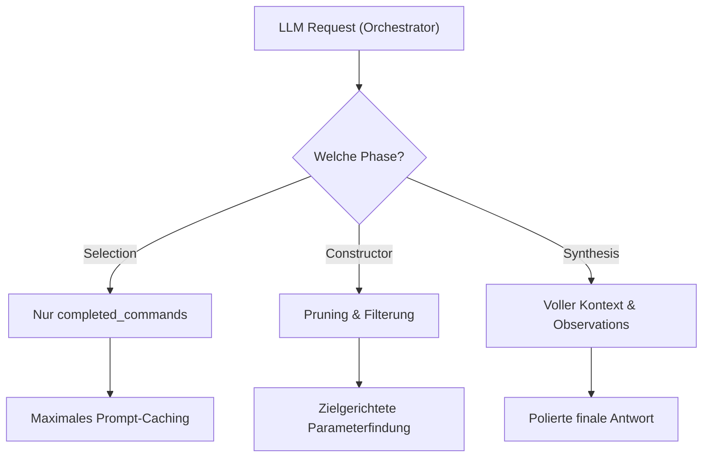

# Prompt-Caching & Redundanz-Analyse (LLM Debug-Audit)

**Datum:** 2026-06-10  
**Status:** Analyse & Report (Basierend auf den letzten 50 Einträgen aus `local_wbagent_ai_llm_debug`)  
**Ziel:** Untersuchung der aktuellen Prompt-Zusammensetzung, Identifikation von Redundanzen, Cache-Breaker-Analysen und Vorschläge zur Optimierung von Prompt-Caching und Token-Effizienz.

---

## 1. Zusammenfassung der Erkenntnisse (TL;DR)

Eine manuelle Analyse der Debug-Einträge (z. B. Record ID 1347 und 1348) zeigt **massives Optimierungspotenzial**:
1. **Der größte Cache-Breaker ist `completed_observations`:** Derzeit werden die ungefilterten Rohergebnisse aller bisherigen Befehle (z. B. eine Liste mit 50 gebuchten Optionen aus `diagnose_user_booking` oder vollständige Moodle-Nutzerprofile inklusive aller eingeschriebenen Kurse aus `search_users`) in den Prompt injiziert. Da sich diese Daten ständig ändern, wird das **Prompt-Caching komplett ausgehebelt** und die Latenz steigt dramatisch.
2. **Überflüssige Daten in der Selektion (PHASE_SELECTION):** Der Intent-Selector erhält den vollen Inhalt aller Observations. Der Selector benötigt jedoch ausschließlich die Liste der ausgeführten Befehle (`completed_commands`), um zu entscheiden, welcher Schritt als nächstes kommt. Die exakten JSON-Ergebnisse der Tools sind für diese Entscheidung irrelevant.
3. **Mangelnde Filterung im Constructor (PHASE_PARAMETER_CONSTRUCTION):** Der Parameter-Constructor erhält ebenfalls alle historischen Observations (auch die von völlig anderen, nicht verwandten Tasks). Er benötigt jedoch nur die direkt vorausgegangenen Suchergebnisse oder spezifische Kontext-Referenzen.
4. **Enormer Token-Waste:** In den untersuchten Prompts machten die `completed_observations` oft **über 85 % des gesamten Prompts** aus. Bei einem Chatverlauf mit mehreren Runden zahlen wir diesen Overhead bei jedem einzelnen Turn erneut.

---

## 2. Detaillierter Audit der Debug-Einträge

### 2.1 Der Selector-Prompt (Beispiel ID 1347 - `p=sel`)
*   **Beobachtung:** Der Selector (Auswahl des nächsten Skills) erhält den vollen `SKILL CATALOG` aller verfügbaren Fähigkeiten (ca. 7-10 Skills mit Beschreibungen und Triggern). Zusätzlich wird der Block `completed_observations` injiziert.
*   **Redundanz:** Der Selector sieht hier das komplette JSON-Ergebnis von `diagnose_user_booking` (über 100 Zeilen mit 50 Detail-Optionen, IDs, Timestamps) sowie das vollständige Profil von `search_users` (Rollen, Custom-Profile-Fields, alle Moodle-Kurse des Users).
*   **Auswirkung:**
    *   **Cache-Breaking:** Jedes Mal, wenn ein Nutzer eine neue Option bucht oder storniert, ändert sich die Observation. Der Cache des System-Prompts reißt ab diesem Punkt ab.
    *   **Token-Kosten:** Der Prompt wächst künstlich auf das 5- bis 10-fache seiner eigentlich benötigten Größe an.
*   **Fakt:** Der Selector muss nur wissen, *dass* `diagnose_user_booking` gelaufen ist. Das steht bereits in `completed_commands`. Er muss die einzelnen Buchungen nicht im Detail lesen, um den nächsten Skill auszuwählen.

### 2.2 Der Constructor-Prompt (Beispiel ID 1348 - `p=cons`)
*   **Beobachtung:** Nach der Selektion wird der Constructor aufgerufen, um die Parameter für den ausgewählten Skill (z. B. `core.generate_questions`) zu bauen.
*   **Redundanz:** Auch hier wird die gesamte Liste der 50 Buchungsoptionen des Nutzers und das komplette User-Profil mitgeschleift, obwohl der Constructor lediglich die `courseid` und das `topic` für die Frage-Generierung ermitteln soll.
*   **Auswirkung:** Das Modell wird durch irrelevante JSON-Blobs abgelenkt. Es besteht die Gefahr, dass der Constructor falsche IDs aus unrelated Observations extrahiert (z. B. eine `optionid` anstelle der gesuchten `courseid`).

### 2.3 Daten-Bloat bei Core-Skills
*   `core.search_users` liefert alle Rollen und Kurseinstellungen des Nutzers zurück:
    ```json
    "enrolledcourses": [{"courseid": 11, "shortname": "ai", "fullname": "ai", "roles": [...]}, ...]
    ```
    Das ist für den Chat-Agenten in 95 % der Fälle ungenutzter Ballast.
*   `mod_booking.diagnose_user_booking` liefert das komplette Buchungs-History-Array inklusive stornierter Buchungen im Rohformat.

---

## 3. Empfohlener Optimierungsplan

Wir schlagen eine phasenweise Filterung und Kapselung vor, um das Caching zu sichern und Token zu sparen:



### 3.1 Regelung für PHASE_SELECTION (Selector)
*   **Maßnahme:** **Vollständiges Entfernen** von `completed_observations` aus dem Selection-Prompt.
*   **Begründung:** Der Selector entscheidet rein deklarativ anhand des Chat-Verlaufs und der Liste der ausgeführten Befehle (`completed_commands`).
*   **Ergebnis:** Der Prompt wird extrem schlank, die Caching-Trefferrate steigt auf nahezu 95 % für Folgenachrichten.

### 3.2 Regelung für PHASE_PARAMETER_CONSTRUCTION (Constructor)
*   **Maßnahme:** **Pruning (Kürzung) & Relevanz-Filterung** der Observations.
*   **Umsetzung:**
    1. Der Constructor erhält nur Observations von Befehlen, die einen direkten Bezug zum ausgewählten Skill haben (z. B. Suchergebnisse).
    2. Die Observations werden auf ein vereinfachtes Key-Value-Format reduziert (z. B. nur Name und ID der gefundenen Entitäten statt des gesamten DB-Dumps).
    3. Vollständige Objekt-Listen (wie die 50 Optionen) werden auf die Top-3 Einträge gekürzt oder komplett weggelassen, es sei denn, sie wurden im letzten User-Turn explizit referenziert.

### 3.3 Regelung für Synthesizer (Synthesis / Final Reply)
*   **Maßnahme:** Der Synthesizer erhält weiterhin die vollen Observations, da er die Daten für den Nutzer zusammenfassen muss.
*   **Abmilderung:** Da dies der letzte Schritt der Kette ist, ist der Cache-Verlust hier verschmerzbar. Die Performance-Gewinne aus den Schritten 3.1 und 3.2 kompensieren dies bei Weitem.

### 3.4 Daten-Sanitizing auf Tool-Ebene
*   Alle Skills sollten ihre Rückgabewerte für den LLM-Kontext standardmäßig filtern.
*   *Beispiel:* `core.search_users` sollte standardmäßig nur Basisfelder (ID, Name, E-Mail) zurückgeben. Rollen und Einschreibungen sollten nur über einen optionalen Parameter `include_enrolments` geliefert werden, wenn ein Skill dies explizit anfordert.

---

## 4. Erwarteter Nutzen
*   **Token-Reduktion:** Durchschnittlich **50 % bis 80 % weniger Tokens** pro Multi-Turn-Konversation.
*   **Latenz-Verringerung:** Kürzere Prompts führen zu schnelleren Antwortzeiten der API.
*   **Kosten-Ersparnis:** Direkte Senkung der API-Gebühren durch optimiertes Prompt-Caching bei Anthropic/OpenAI.
*   **Stabilität:** Weniger "Hintergrundrauschen" im Prompt reduziert Fehlinterpretationen des Modells bei der Parameterfindung.
