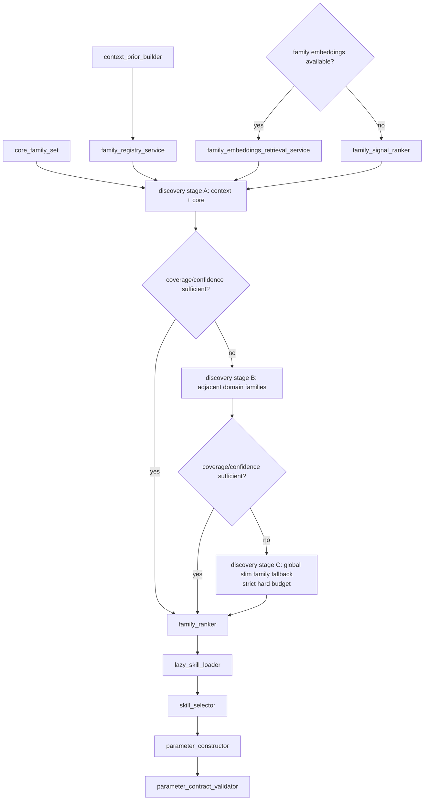

# Task-Katalog- und Planner-Analyse

Dieses Dokument beschreibt das aktuelle Verhalten des Task-Katalogs im bookingextension_agent so genau wie moeglich fuer eine externe technische Analyse.

Der Fokus liegt auf diesen Fragen:

- Wie sicher und deterministisch verhaelt sich der Katalog?
- Wie unterscheiden sich slim catalog und embeddings top-k catalog?
- Was passiert im ersten Planner-Step, in Folgeschritten und in mehreren Klaerungen?
- Welche Rolle spielt der Synchronizer bzw. die Finalisierung?
- Welche Methoden und Codepfade sind dabei relevant?

## Kurzfazit

Das System ist im Kern sicher, weil es keine freien Task-Namen erfindet, sondern alle Kataloge aus der Registry ableitet. Es ist aber nicht voll deterministisch, weil die embeddings-basierte Auswahl semantisch arbeitet und vom letzten User-Text, vom Availability-Check und vom Cache abhaengt.

Die wichtigste Sicherheitseigenschaft ist die Trennung von drei Ebenen:

- Registry und Contract-Validierung definieren, welche Tasks existieren duerfen.
- Der Planner bekommt nur eine reduzierte, strukturierte Sicht auf diese Tasks.
- Die Finalisierung/Synchronizer-Schicht darf nur die user-facing Nachricht glattschleifen, aber keine Commands oder Response-Semantik veraendern.

Aus Risiko-Sicht ist der robusteste Teil der Pfad ohne embeddings. Der embeddings-Pfad ist nuetzlich fuer Relevanz, aber semantisch unschaerfer und daher die Hauptquelle fuer Fehlklassifikationen, die sich erst in nachfolgenden Klaerungen korrigieren.

## Relevante Codeoberflaechen

Die Analyse bezieht sich insbesondere auf diese Dateien:

- [classes/local/wbagent/orchestrator.php](../../classes/local/wbagent/orchestrator.php)
- [classes/local/wbagent/services/catalog/adaptive_task_catalog_service.php](../../classes/local/wbagent/services/catalog/adaptive_task_catalog_service.php)
- [classes/local/wbagent/skill_registry.php](../../classes/local/wbagent/skill_registry.php)
- [classes/local/wbagent/skill_executability_evaluator.php](../../classes/local/wbagent/skill_executability_evaluator.php)
- [classes/local/wbagent/services/embeddings/embeddings_retrieval_service.php](../../classes/local/wbagent/services/embeddings/embeddings_retrieval_service.php)
- [classes/local/wbagent/services/embeddings/embeddings_readiness_service.php](../../classes/local/wbagent/services/embeddings/embeddings_readiness_service.php)
- [classes/local/wbagent/services/finalization_classifier.php](../../classes/local/wbagent/services/finalization_classifier.php)
- [classes/local/wbagent/agent_runtime.php](../../classes/local/wbagent/agent_runtime.php)
- [classes/local/wbagent/core/tasks/recreate_skill_catalog_task.php](../../classes/local/wbagent/core/tasks/recreate_skill_catalog_task.php)
- [classes/task/rebuild_skill_catalog_embeddings_adhoc.php](../../classes/task/rebuild_skill_catalog_embeddings_adhoc.php)

## Architektur in einem Satz

Der Planner sieht zuerst eine kompakte, strukturierte Katalogsicht; wenn der Wunderbyte-Embeddings-Pfad aktiv ist, wird diese Sicht auf eine semantisch ausgewaehlte Top-K-Menge verengt; die Finalisierung darf anschliessend nur die Nachricht polieren, nie aber Commands oder Response-Typen umdeuten.

## Ablaufmodell

### 1. Registry als Autoritaetsquelle

Die Registry ist die erste und wichtigste Sicherungsschicht. Sie registriert nur Tasks, die ein valides Task-Interface und valide Metadaten liefern.

Wesentliche Methoden:

- `skill_registry::register()`
- `skill_registry::get_task()`
- `skill_registry::get_task_contract()`
- `skill_registry::get_task_contracts()`
- `skill_registry::get_all_prompt_contracts()`
- `skill_registry::get_prompt_contracts_for_context()`
- `skill_registry::get_all_schemas_for_context()`
- `skill_registry::is_task_active()`
- `skill_registry::get_task_capabilities()`
- `skill_registry::get_task_names_for_context()`
- `skill_executability_evaluator::evaluate_task()`
- `skill_executability_evaluator::evaluate_all_tasks()`
- `skill_executability_evaluator::get_executable_task_names()`

Sicherheitsrelevante Eigenschaften:

- Reservierte Namespaces werden blockiert.
- Doppelte Tasknamen werden nicht uebernommen.
- Metadaten muessen den Contract-Validator passieren.
- Ein Task kann vorhanden, aber fuer den konkreten User oder Kontext nicht ausfuehrbar sein.

Das ist wichtig: Der Katalog ist nicht gleichbedeutend mit "ausfuehrbar". Die Registry liefert die Kandidaten, der Evaluator entscheidet die Ausfuehrbarkeit.

### 2. Adaptive Katalogisierung

Die eigentliche Katalogverkleinerung sitzt in `adaptive_task_catalog_service`.

Wesentliche Methoden:

- `adaptive_task_catalog_service::get_adaptive_catalog()`
- `adaptive_task_catalog_service::get_mandatory_tasks()`
- `adaptive_task_catalog_service::get_recency_filtered()`

Verhalten:

- Fuer `tool_call_parse` wird der volle Katalog unveraendert durchgereicht.
- Fuer `simple_retrieval` und `final_synthesis` wird ein Tiering verwendet.
- Mandatory Tasks bleiben immer sichtbar.
- Recency wird als strukturelles Signal fuer Kontinuitaet verwendet.
- Ab Step 2 wird nicht mehr alles gezeigt, sondern ein Top-K Ausschnitt.

Die adaptive Schicht ist bewusst sprachagnostisch. Sie arbeitet nicht ueber Freitext-Heuristiken, sondern ueber Taskstruktur und Taskhistorie.

### 3. Slim Catalog

Der Slim Catalog entsteht im Orchestrator ueber `slim_prompt_catalog_for_planner()`.

In der aktuellen Telemetrie und in den Debug-Ansichten erscheint dieser Zustand oft als `slim_all`. Der Name ist wichtig: Gemeint ist nicht eine Reduktion der Task-Anzahl, sondern die kompakte Projektionsform des vollstaendigen Registry-Katalogs.

Wesentliche Methoden:

- `orchestrator::slim_prompt_catalog_for_planner()`
- `orchestrator::compact_catalog_description()`
- `orchestrator::compact_catalog_example_input()`
- `orchestrator::compact_catalog_message_triggers()`

Der Slim Catalog ist die Standarddarstellung fuer den Planner, bevor embeddings greifen. Er enthaelt nur wenige, gezielt gekuerzte Felder:

- `task`
- `readonly`
- `intent`
- `minimal_input`
- `example_input` als kompaktes Feldnamen-Signal, nicht als voller Payload
- `description` auf kurze Laenge gekuerzt
- `message_triggers` auf kompakte Trigger-Daten reduziert

Wichtig fuer die Sicherheit:

- Vollstaendige Beispielpayloads werden bewusst nicht in den Slim Catalog kopiert.
- Wenn `example_input` leer ist oder identisch zu `minimal_input` ist, wird es entfernt.
- `compact_catalog_example_input()` behaltet nur Feldnamen und begrenzt die Anzahl auf 12.
- `compact_catalog_description()` kuerzt Beschreibungen auf 240 Zeichen.
- `compact_catalog_message_triggers()` kuerzt Triggerbeschreibung und reduziert Beispiele stark.

Bewertung:

- Sehr sicher fuer strukturelle Planner-Routing-Entscheidungen.
- Mittel-sicher fuer feingranulare Payload-Vorbereitung, weil bewusst viele Details entfernt werden.
- Besonders gut fuer Robustheit gegen Prompt-Bloat.

Das ist der zentrale Trade-off: Der Slim Catalog ist absichtlich klein und stabil, aber nicht maximal informationsreich.

Fuer `cm=slim_all` gilt deshalb:

- Er zeigt weiterhin alle Tasks, die in diesem Kontext sichtbar sind.
- Er ist formal schlank, weil die Einzel-Tasks pro Eintrag auf routing-relevante Metadaten verdichtet werden.
- Er ist kein embeddings-Top-K-Katalog und keine semantische Vorauswahl.
- Er ist genau dann sinnvoll, wenn der Planner nicht am semantischen Recall scheitern darf, aber trotzdem keine volle Contract-Masse pro Task mehr sehen soll.

Das macht `slim_all` zu einer Zwischenstufe: alle sichtbaren Tasks bleiben erhalten, aber jeder einzelne Task-Eintrag wird deutlich leichter.

### 4. Embeddings Top-K Catalog

Der embeddings-basierte Pfad ist eine weitere Verengung des Slim Catalogs. Er wird nur genutzt, wenn bestimmte Bedingungen erfuellt sind.

Wesentliche Methoden:

- `embeddings_readiness_service::is_wunderbyte_embeddings_available()`
- `embeddings_readiness_service::get_catalog_status()`
- `embeddings_readiness_service::ensure_rebuild_scheduled_if_needed()`
- `embeddings_retrieval_service::search_top_k()`
- `embeddings_retrieval_service::build_planner_catalog_subset()`
- `embeddings_retrieval_service::build_live_contract_lookup()`
- `embeddings_retrieval_service::compact_properties_for_planner()`
- `embeddings_retrieval_service::cosine_similarity()`
- `embeddings_retrieval_service::decode_json_array()`

Der embeddings-Pfad wird im Orchestrator nur aktiv, wenn alle wesentlichen Bedingungen passen:

- Route ist Wunderbyte-Routing.
- Action-Class ist der Planner-Decision-Pfad.
- Es gibt einen Query-Text aus der letzten User-Nachricht.
- Embeddings sind verfuegbar.
- Der CSV-Katalog ist vorhanden, schema-valide und nicht stale.

Die wichtigsten Konstanten sind:

- Embedding-Modell: `text-embedding-3-small`
- Dimensionen: `1536`
- Top-K: `6`
- Rebuild-Debounce: `300` Sekunden

Was dann passiert:

1. Der letzte User-Text wird eingebettet.
2. `search_top_k()` berechnet Cosine Similarity ueber die CSV-Zeilen.
3. `build_planner_catalog_subset()` mappt die Treffer zur Live-Registry zurueck.
4. Falls ein Live-Contract vorhanden ist, gewinnt der Live-Contract gegen die CSV-Beschreibung.
5. Falls ein Task im konkreten Kontext nicht ausfuehrbar ist, wird er nicht in die aktive Menge uebernommen, sondern in die Unavailable-Liste verschoben.
6. Danach kann `augment_catalog_with_recent_executable_tasks()` noch einen zuletzt erfolgreichen Task ergaenzen.
7. `sanitize_unavailable_task_catalog()` entfernt defekte Eintraege.

Bewertung:

- Sicher gegen wilde Tasks, weil immer auf Registry- und Contract-Daten zurueckgemappt wird.
- Semantisch nuzlich, aber nicht voll deterministisch.
- Die groesste Unsicherheit entsteht durch Query-Missmatch, nicht durch unkontrollierte Task-Erfindung.

### 4a. Typische Top-K Ausgabe und Informationsueberladung

Die von dir gezeigte Beispielausgabe ist ein wichtiger Zusatzfall, weil sie die reale Form des Top-K Katalogs zeigt. Das ist nicht mehr nur eine schlanke Routing-Sicht, sondern ein sehr breit ausgeklappter Task-Contract-Datensatz.

Typische Felder in so einer Top-K Ausgabe sind:

- `task`
- `description`
- `readonly`
- `intent`
- `anchors`
- `minimal_input`
- `example_input`
- `namespace`
- `version`
- `capabilities`
- `context_scopes`
- `message_triggers`
- `properties`

Die Beispielzeilen zeigen gut, warum die Ausgabe geschwaecht werden kann:

- `core.recall_memory` ist als strukturierter Task kompakt genug, aber die Beschreibung ist schon relativ lang und enthaelt mehrere Bedingungszweige.
- `mod_booking.create_slotbooking_option` und `mod_booking.create_option` tragen sehr viele Properties, Trigger-Hinweise und teilweise lange Beschreibungen mit.
- `mod_booking.create_option` ist besonders schwergewichtig, weil die `properties`-Sektion sehr gross wird und damit Token, Aufmerksamkeit und Vergleichbarkeit fuer nachfolgende Planner-Entscheidungen belastet.
- `mod_booking.explain_docs_topic` ist ein guter Beleg dafuer, dass sogar read-only Analyse-Tasks noch mehrere Hilfsparameter und Dokumentationspfade mitbringen.

Die Haupteffekte dieser Breite sind:

- Mehr Tokenverbrauch im Planner-Prompt.
- Mehr konkurrierende Hinweise pro Task, dadurch weniger klare Priorisierung.
- Hoehere Wahrscheinlichkeit, dass der Planner zwar den richtigen Task erkennt, aber die Parameterrelevanz schlechter trennt.
- Mehr Risiko, dass lange `properties`-Bloecke die eigentliche semantische Aufgabe ueberdecken.

Das heisst nicht, dass der Top-K Katalog falsch ist. Er ist strukturell korrekt und fuer spaetere Ausfuehrung gut brauchbar. Aber fuer reine Planner-Routing-Phasen kann er zu breit sein.

Praktisch sind hier drei unterschiedliche Niveaus zu unterscheiden:

1. `slim_all` oder `slim_prompt_catalog_for_planner()`: minimal und robust fuer Routing.
2. `embed_topk`: semantisch verengt, aber noch mit Live-Contract-Sicherheit.
3. volle oder fast volle Task-Contract-Ausgabe: am informationsreichsten, aber auch am empfindlichsten fuer Prompt-Ueberladung.

Fuer die externe Analyse ist das der zentrale Punkt: Nicht nur die Task-Auswahl selbst kann unscharf werden, sondern schon die Form der Katalogdarstellung kann die Planner-Qualitaet reduzieren. Der Effekt ist besonders stark, wenn Top-K-Listen mit umfangreichen `properties`-Objekten, langen Trigger-Listen und vielen Beispielwerten kombiniert werden.

Aus der Dokumentperspektive ist deshalb zu bewerten:

- Der Top-K Katalog ist inhaltlich korrekt, aber operational schwergewichtig.
- Das System profitiert von Recency- und Slimming-Regeln, gerade weil die volle Contract-Darstellung zu breit ist.
- Wenn ein Task in mehreren Varianten mit ähnlichem Intent vorkommt, muss der Planner nicht nur den richtigen Task finden, sondern auch die richtige Parameterform aus der langen Ausgabe herausfiltern.

Damit ist deine Vermutung gut begruendet: Zu viele mitkommende Informationen schwaechen die Ausgabe nicht inhaltlich falsch, aber in der Praxis deutlich schwerer verarbeitbar.

### 5. Planner First Step

Der erste Planner-Step ist der wichtigste Pfad fuer initiale Taskauswahl.

Wesentliche Konstanten und Methoden:

- `orchestrator::STEP_TYPE_TOOL_CALL_PARSE`
- `orchestrator::build_runtime_context_block()`
- `orchestrator::build_system_prompt()`
- `orchestrator::build_prompt()`

Im aktuellen Verhalten gilt:

- Task-Katalog wird fuer `tool_call_parse` nur dann eingeblendet, wenn keine Observations vorliegen.
- In diesem Fall wird zunaechst der Slim Catalog aus allen Prompt Contracts gebaut.
- Wenn der Wunderbyte-Embeddingspfad greift, kann dieser Slim Catalog auf Top-K reduziert werden.
- Fuer den ersten Assistant-Turn wird im Runtime-Context die Sprachregel gesetzt, wenn keine Observations vorhanden sind.

Das bedeutet: Der erste Schritt ist bewusst breit genug, um nichts zu verpassen, aber schon klein genug, um das Prompt stabil zu halten.

Sicherheitsbewertung:

- Hoch fuer Initial-Routing, weil der Katalog aus der Registry stammt.
- Mittel fuer semantische Praezision, weil embeddings die Sicht verengen koennen.
- Sehr hoch fuer Formatstabilitaet, weil die Ausgabe-Contract-Sicht am Promptende explizit bleibt.

### 6. Planner Next Steps

Bei Folgeschritten wird der Katalog selektiver.

Wesentliche Logik im Orchestrator:

- `extract_recent_task_names_from_messages()` liest vergangene Tasknamen aus Assistant-Metadaten.
- `normalize_planner_trace_history()` stabilisiert die Planner-Trace-Historie aus Thread-Metadaten.
- `append_planner_traces_and_observations()` mischt Traces und Observations geordnet ein.
- `augment_catalog_with_recent_executable_tasks()` ergaenzt einen kleinen Kontinuitaetsanker aus der letzten erfolgreichen Taskhistorie.

Behavior fuer den Folgetakt:

- `simple_retrieval` bekommt den Katalog nur dann, wenn es effektive Observations gibt.
- Framework-interne Retry-Hints werden dabei nicht als effektive Observations gewertet.
- Die adaptive Katalogstufe nutzt Mandatory + Recency statt Full Catalog.
- Der embeddings-Pfad kann weiterhin Top-K auswaehlen, wenn die Bedingungen erfuellt sind.

Damit wird das Verhalten nach mehreren Klaerungen stabilisiert. Der Planner bleibt am letzten echten Taskkontext haengen und nicht an leeren oder rein technischen Retry-Schleifen.

### 7. Mehrere Klaerungen hinweg

Das System hat mehrere Kontinuitaetsanker:

- Letzte User-Nachricht fuer embeddings Query.
- Assistant-Metadaten fuer `attempted_skills` und `commands`.
- Thread-Metadaten fuer `planner_trace_history`.
- Completed Commands und Completed Observations in der Runtime-Kontextsektion.
- Recency-Filter im adaptiven Katalog.

Das ist fuer Mehrfach-Klaerungen wichtig, weil dieselbe Anfrage oft nicht in einem Zug geloest wird. Die Kontinuitaet entsteht nicht ueber vage Sprachheuristiken, sondern ueber gespeicherte Struktur-Signale.

Starke Punkte:

- Ein bereits ausgewaehlter oder ausgefuehrter Task kann in spaeteren Runden wieder sichtbar werden.
- Der embeddings-Top-K Pfad wird durch eine kleine, explizite Recency-Ergaenzung stabilisiert.
- Planner-Trace und Observation-Historie koennen die Auswahl ueber mehrere Schritte nachvollziehbar machen.

Grenzen:

- Nur ein Teil der Historie wird in den sichtbaren Katalog uebernommen.
- Wenn ein Task nicht im letzten User-Text semantisch klar bleibt, kann embeddings ihn aus dem Top-K verlieren.
- Wenn nur technische Retry-Hints vorhanden sind, wird kein neuer Katalog-Step erzwungen.

### 8. Synchronizer / Finalisierung

Im aktuellen Code gibt es keinen separaten Synchronizer-Service als Hauptobjekt. Die Funktionalitaet liegt in der Runtime-Finalisierung und insbesondere in `agent_runtime::apply_synchronizer_message_polish()`.

Wesentliche Methoden:

- `agent_runtime::finalize_and_persist_result()`
- `agent_runtime::apply_finalization_strategy()`
- `agent_runtime::apply_template_only_finalization()`
- `agent_runtime::apply_synchronizer_message_polish()`
- `agent_runtime::merge_synchronized_message()`
- `agent_runtime::build_final_synthesis_source_observation()`
- `agent_runtime::should_reject_synchronized_message()`
- `finalization_classifier::classify()`

Die Finalisierung arbeitet deterministisch uebers Ergebnis-Metadaten:

- `response_type`
- `commands`
- `issue_codes`
- `error_class`
- `structural_failure`

Das Klassifikationsschema ist einfach:

- `direct_final`, wenn Commands vorhanden sind, ein direkter Response-Typ vorliegt oder harte Issue-Codes vorhanden sind.
- `template_only`, wenn Budget-, Timeout-, Permission- oder andere harte technische Fehler vorliegen.
- `llm_polish`, wenn nur die Nachricht sprachlich nachgeglattet werden soll.

Wichtig fuer die Sicherheit:

- `merge_synchronized_message()` uebernimmt nur Message und optional Language.
- Commands aus dem Synchronizer-Output werden verworfen.
- `should_reject_synchronized_message()` blockiert response_type `error`, `CONTRACT_`-Issue-Codes sowie JSON-Parse- und Raw-Excerpt-Hinweise.
- `build_final_synthesis_source_observation()` gibt dem finalen Synthese-Step den originalen Source-Result-Kontext mit.

Bewertung:

- Sehr hoch fuer Semantik-Schutz.
- Sehr hoch fuer Command-Sicherheit.
- Mittel fuer Linguistik, weil die Endnachricht bewusst nachbearbeitet werden darf.

### 9. Recreate Task Catalog

Der Task `core.recreate_skill_catalog` ist selbst ein gutes Beispiel fuer den Sicherheitsansatz des Systems.

Wesentliche Methoden:

- `recreate_skill_catalog_task::get_name()`
- `recreate_skill_catalog_task::get_schema()`
- `recreate_skill_catalog_task::get_message_triggers()`
- `recreate_skill_catalog_task::check_structure()`
- `recreate_skill_catalog_task::execute()`
- `rebuild_skill_catalog_embeddings_adhoc::execute()`

Dieses Task-Set zeigt, dass der Katalog nicht statisch ist, sondern regelbasiert neu aufgebaut werden kann. Der Rebuild task erzeugt dabei die CSV neu und kann ungenutzte bzw. stale Eintraege entfernen.

Fuer die Sicherheitsanalyse relevant:

- Der Katalog kann stale werden, aber das System hat einen geplanten Rebuild-Pfad.
- Der Rebuild ist nicht frei von LLM-Fehlern, sondern serverseitig deterministisch aufgebaut.
- Falsche Dimensionen werden in `check_structure()` abgefangen.

## Bewertungsmatrix

### Slim Catalog

Sehr sicher fuer Routing und Prompt-Stabilitaet, weil:

- nur strukturierte Felder verwendet werden,
- Payloads und Trigger radikal gekuerzt werden,
- keine freien Text-Heuristiken fuer Taskwahl benutzt werden.

Hauptschwaeche:

- Detailverlust bei Beispielinputs und langen Beschreibungen.

### Embeddings Top-K Catalog

Mittel bis hoch sicher, weil:

- nur auf bekannte Registry-Tasks zurueckgemappt wird,
- die aktive Menge nach Kontext- und Capability-Check gefiltert wird,
- ein Cache die Auswahl fuer identische Queries stabilisiert.

Hauptschwaeche:

- semantische Fehlwahl ist moeglich, obwohl die Struktur korrekt bleibt.

### Planner First Step

Sehr robust, weil:

- der Katalog auf der Registry basiert,
- der Prompt nur bei fehlenden Observations eingeblendet wird,
- der Output-Contract explizit ist.

Hauptschwaeche:

- der embeddings-Pfad kann den Raum zu stark verengen, wenn der User-Text mehrdeutig ist.

### Planner Next Steps

Robust fuer Mehrfach-Klaerungen, weil:

- Recency und Planner-Trace-Historie erhalten bleiben,
- bereits erfolgreiche Tasks erneut sichtbar bleiben koennen,
- technische Retry-Hints nicht als echte inhaltliche Observations gelten.

Hauptschwaeche:

- zu starke Verengung kann einen spaeter doch passenden Task voruebergehend ausblenden.

### Synchronizer

Sehr sicher fuer Output-Semantik, weil:

- er nur die Nachricht polieren darf,
- er Commands nicht erfinden darf,
- er bei Strukturdrift zur Source-Message zurueckrollt.

Hauptschwaeche:

- reine Sprachpolitur kann den Eindruck erzeugen, es sei mehr passiert als tatsaechlich der Fall ist, wenn das Source-Result schlecht formuliert ist. Die Semantik bleibt aber geschuetzt.

## Methode fuer Methode: Kompakte Inventur

### adaptive_task_catalog_service

- `get_adaptive_catalog()`
- `get_mandatory_tasks()`
- `get_recency_filtered()`

### orchestrator

- `slim_prompt_catalog_for_planner()`
- `compact_catalog_description()`
- `compact_catalog_example_input()`
- `compact_catalog_message_triggers()`
- `extract_recent_task_names_from_messages()`
- `is_first_assistant_turn()`
- `build_prompt()`
- `build_local_output_contract_block()`
- `normalize_planner_trace_history()`
- `append_planner_traces_and_observations()`
- `build_runtime_context_block()`
- `append_json_object_section()`
- `append_json_list_section()`
- `json_encode_or_empty()`
- `availability_from_deny_reason()`
- `sanitize_unavailable_task_catalog()`
- `build_task_description_index()`
- `augment_catalog_with_recent_executable_tasks()`

### skill_registry

- `register()`
- `get_task()`
- `get_provider_for_task()`
- `normalize_task_input()`
- `get_preview_option_memory_for_task()`
- `get_preview_option_memory_helpers()`
- `get_task_names()`
- `get_task_names_for_context()`
- `get_tasks()`
- `get_task_contract()`
- `get_task_contracts()`
- `get_contract_diagnostics()`
- `get_result_summary_contributors()`
- `is_read_only_task()`
- `is_task_active()`
- `get_skill_toggle_setting_name()`
- `get_task_capabilities()`
- `get_all_schemas()`
- `get_all_schemas_for_context()`
- `explain_task_schema_for_context()`
- `get_all_prompt_contracts()`
- `get_prompt_contracts_for_context()`

### skill_executability_evaluator

- `evaluate_task()`
- `evaluate_all_tasks()`
- `get_executable_task_names()`
- `deny_result()`
- `has_required_capabilities()`
- `is_valid_context()`

### embeddings_retrieval_service

- `search_top_k()`
- `build_planner_catalog_subset()`
- `build_live_contract_lookup()`
- `compact_properties_for_planner()`
- `cosine_similarity()`
- `decode_json_array()`

### embeddings_readiness_service

- `is_wunderbyte_embeddings_available()`
- `get_catalog_status()`
- `ensure_rebuild_scheduled_if_needed()`

### family_embeddings_index_service

- `rebuild_catalog()`

### finalization_classifier

- `classify()`
- `has_commands()`
- `normalize_issue_codes()`
- `contains_any()`

### agent_runtime

- `finalize_and_persist_result()`
- `apply_finalization_strategy()`
- `apply_template_only_finalization()`
- `apply_synchronizer_message_polish()`
- `merge_synchronized_message()`
- `build_final_synthesis_source_observation()`
- `should_reject_synchronized_message()`
- `normalize_issue_codes()`
- `normalize_nonempty_string_list()`
- `finalize_and_persist_budget_exceeded()`
- `budget_guard_allows_next_llm_call()`
- `build_budget_exceeded_result()`

### task definitions for catalog rebuild

- `recreate_skill_catalog_task::get_name()`
- `recreate_skill_catalog_task::get_schema()`
- `recreate_skill_catalog_task::get_message_triggers()`
- `recreate_skill_catalog_task::check_structure()`
- `recreate_skill_catalog_task::execute()`
- `rebuild_skill_catalog_embeddings_adhoc::execute()`

## Mermaid-Uebersicht

```mermaid
flowchart TD
    A[Planner Step: tool_call_parse] --> B[Registry contracts via get_prompt_contracts_for_context()]
    B --> C[slim_prompt_catalog_for_planner()]
    C --> D{Wunderbyte route + embeddings ready + query text}
    D -->|no| E[Planner sees slim_all catalog]
    D -->|yes| F[search_top_k() on skill_catalog_embeddings.csv]
    F --> G[build_planner_catalog_subset()]
    G --> H[filter by skill_executability_evaluator]
    H --> I[optional augment_catalog_with_recent_executable_tasks()]
    I --> J[Planner sees embed_topk catalog]
    E --> K[Planner next steps]
    J --> K
    K --> L[simple_retrieval uses adaptive_task_catalog_service]
    L --> M[final_synthesis / Synchronizer phase]
    M --> N[finalization_classifier::classify()]
    N --> O{direct_final / template_only / llm_polish}
    O --> P[apply_synchronizer_message_polish()]
    O --> Q[template-only fallback]
    O --> R[direct final]
    P --> S[merge_synchronized_message()]
    S --> T[persist_assistant_message()]
```

### Mermaid-Detail: Context+Core Discovery mit A/B/C-Fallback

Diese Detailansicht spiegelt den refaktorierten Planner-Discovery-Pfad aus dem Implementierungs-Flowchart wider und trennt Family-Discovery strikt von Task-Selection und Parameter-Konstruktion.



Kurzregeln fuer den Betrieb dieses Discovery-Pfads:

1. Budget-Regel:
    Stage A ist der Standard mit kleinem, hart begrenztem Family-Budget.
    Stage B erweitert nur moderat auf angrenzende Familien.
    Stage C bleibt ein strikt gedeckelter Global-Fallback und liefert niemals einen Full-Task-Dump.

2. Confidence-Regel:
    Der Uebergang von Stage A nach B und von B nach C erfolgt nur, wenn die kombinierte Abdeckung/Konfidenz unter dem definierten Schwellwert bleibt.
    Sobald die Schwelle erreicht ist, stoppt die Expansion und der Flow geht in Ranking/Selection.

3. Eskalations-Regel:
    Eskaliert wird nur stufenweise A -> B -> C und nur mit explizitem Coverage/Confidence-Fail.
    Nach Stage C erfolgt kein weiterer Katalog-Ausbau, sondern direkte Weitergabe an family_ranker und danach skill_selector.

## Offene Fragen fuer externe Analyse

- Reicht die Top-K-Groesse von 6 in realen Mehrfach-Klaerungen aus, oder ist der semantische Recall zu klein?
- Sollte die Recency-Ergaenzung im embeddings-Pfad weiter begrenzt oder an bestimmte Task-Klassen gebunden werden?
- Ist der Abstand zwischen slim catalog und embeddings subset gross genug, um Fehlrouting zu erklaeren und messbar zu machen?
- Sollten wir fuer externe Audits noch explizitere Telemetrie ueber `catalogselectionmode`, `embeddingstatus` und `planner_trace_history` dokumentieren?
- Ist der Synchronizer derzeit streng genug, oder sollte die Driftpruefung noch mehr Semantik blockieren?

## Praktische Gesamtbewertung

Wenn das Ziel ist, Fehlverhalten spaeter wieder aufloesen zu koennen, dann ist das aktuelle Verhalten insgesamt gut: Der erste Schritt bleibt breit, der embeddings-Pfad verengt nur bei passenden Bedingungen, und spaetere Steps koennen ueber Recency und Observations wieder in die richtige Richtung gezogen werden.

Wenn das Ziel maximale Vorhersagbarkeit ist, dann bleibt der embeddings-Pfad die groesste Restunsicherheit. Diese Unsicherheit betrifft aber die Auswahlreihenfolge, nicht die strukturelle Sicherheit der Ausfuehrung.

Wenn das Ziel eine externe Analyse ist, dann sind die wichtigsten Belege:

- Registry und Evaluator als harte Autoritaet
- Slim Catalog als strukturierte Minimalansicht
- Embeddings Top-K als semantische Verengung mit Cache und Kontextchecks
- Synchronizer als reine Finalisierungs- und Politurgrenze ohne Semantikverlust