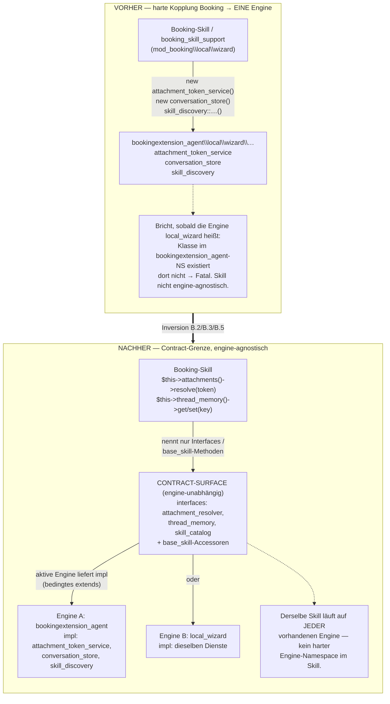

# Skill ↔ Engine-Service-Grenze (Leaks B.2/B.3/B.5) — Status quo + Ideal-Architektur

**Datum:** 2026-06-29
**Status:** Planung (keine Code-Änderung)
**Kontext:** Phase 0 A.1–A.3 + B.1/B.4 sind erledigt (DTO-freier Skill-Contract, final-gelockt). Verbleiben die 3 Leaks, bei denen Booking-Code **engine-eigene Dienste** direkt referenziert. Dieses Doc erklärt den genauen Status quo und plant die Ziel-Architektur.

---

## 1. Status quo (präzise)

Drei Dienste sind **Eigentum der Engine** (`bookingextension_agent\local\wizard\…`), werden aber von **Booking-Code** (`mod_booking\local\wizard\…`) direkt instanziiert/aufgerufen:

| Engine-Dienst | Was er besitzt | Referenziert von (Booking) |
|---|---|---|
| `services\attachment\attachment_token_service` | Lebenszyklus der **Chat-Upload-Temp-Dateien** (User lädt Bild im Agent-Chat hoch → Engine speichert + gibt Token) | `booking_skill_mutation_execute_service::apply_headerimage_token_to_data()` → `new attachment_token_service()->resolve($token,…)` |
| `conversation_store` | **Konversations-/Thread-Daten** (`local_wizard_ai_threads`, Thread-Metadaten) | `booking_skill_support` (4 Methoden: resolve/remember last_option + last_preview) |
| `skill_discovery` | **Skill-Enumeration** (scannt+instanziiert Skill-Klassen einer Komponente) | `skill_provider::get_skills()/get_discovery_diagnostics()`, `booking_skill_support::get_skill_instances()` |

**Wichtig:** Das *Feature* ist jeweils booking-spezifisch (Header-Bild ans Booking-Option, „letzte Option" im Booking-Flow). Aber der *Dienst*, der die Arbeit tut, ist engine-eigen (Attachments, Konversation, Registry). Die Kopplung läuft also **Booking → Engine**.

### Warum das HEUTE kein Fehler ist
`bookingextension_agent` **ist** aktuell die Engine (mit Booking ausgeliefert). Die harte Referenz `bookingextension_agent\…\attachment_token_service` löst auf und funktioniert. Alle Suiten grün.

### Warum es beim CUT ein Problem wird
Ziel-Modell (siehe `local_wizard_extraction_plan_2026-06-28.md` §5b): ein Skill `extends` bedingt die *vorhandene* Engine (`local_wizard\…\base_skill` ODER `bookingextension_agent\…\base_skill`), damit derselbe Skill auf **jeder** Engine läuft. Eine **harte** Referenz auf *einen* Engine-Namespace bricht das:
- Auf einem **`local_wizard`-only**-Install (kein Agent): `bookingextension_agent\…\attachment_token_service` existiert nicht → Fatal beim Laden.
- Der Skill ist nicht mehr engine-agnostisch.

Also: dieselbe Disziplin wie bei `base_skill`/DTOs — **kein Skill (und kein von Skills genutzter Helfer) darf einen Engine-Service-Typ hart nennen.**

---

## 2. Ideal-Architektur

**Prinzip:** Engine-eigene Dienste, die Skills legitim brauchen, werden über die **Engine-Basis (`base_skill`) als Zugriffsmethoden** bereitgestellt — genau wie `pass()/invalid()` für den Preflight. Weil `base_skill` *die vorhandene Engine* ist (bedingtes `extends`), löst `$this->…()` automatisch auf die aktive Engine auf. Der Skill nennt **keinen** Engine-Service-Typ.

Konkret — drei schmale **Contract-Interfaces** (in der Contract-Surface, engine-unabhängig) + `base_skill`-Accessoren, die die Implementierung der aktiven Engine liefern:

| Contract-Interface | base_skill-Accessor | Engine implementiert mit |
|---|---|---|
| `attachment_resolver` (`resolve(token,userid,ctx): {path,filename}`) | `$this->attachments()` | heutiger `attachment_token_service` |
| `thread_memory` (`get(key)/set(key,value)` thread-scoped) | `$this->thread_memory()` | heutiger `conversation_store` |
| `skill_catalog` (`instances(component): skill[]`) | via Provider/Registry injiziert | heutiger `skill_discovery` |

- **Skill-Seite:** `$this->attachments()->resolve($token,…)` statt `new attachment_token_service()`. Der Skill importiert höchstens das **Interface** aus der Contract-Surface, nie die Engine-Klasse.
- **`booking_skill_support`** (statisch, KEIN Skill): bekommt die benötigten Daten **vom aufrufenden Skill hineingereicht** (der Skill hat die `$this->…()`-Accessoren) — statt selbst `new conversation_store()` zu rufen. Alternativ instanzbasiert mit injizierten Diensten.
- **`skill_provider`** (engine-seitiger Adapter, implementiert `skill_provider_interface`): ist *bewusst* engine-gebunden (er IST die Brücke). Sein `skill_discovery`-Aufruf bleibt akzeptabel ODER nutzt das `skill_catalog`-Interface. Niedrigste Priorität.

**Heißt für die Tabellen-Frage (Auskopplung):** Attachments/Threads bleiben Engine-Daten (`local_wizard_*`/`bx_agent_*`). Der Booking-Skill kennt nur „gib mir die Datei zu diesem Token" — egal welche Engine das ausführt.

---

## 3. Vorher / Nachher (Flowchart)

---

## 4. Umsetzungs-Schnitt (wenn beschlossen)

1. **Contract-Interfaces** definieren: `attachment_resolver`, `thread_memory`, `skill_catalog` (in der Engine, Sub-Namespace `interfaces\`; Teil der Contract-Surface).
2. **Engine-Adapter:** die heutigen Dienste (`attachment_token_service`, `conversation_store`, `skill_discovery`) implementieren die Interfaces (oder dünne Adapter).
3. **`base_skill`-Accessoren:** `$this->attachments()`, `$this->thread_memory()` liefern die Engine-Implementierung.
4. **Booking-Seite umstellen:**
   - **B.5:** `apply_headerimage_token_to_data` ruft `$this->attachments()->resolve(...)` (Skill-Pfad) — Draft-Staging bleibt booking-seitig.
   - **B.2:** die 4 `booking_skill_support`-Methoden bekommen Thread-Memory injiziert / vom Skill durchgereicht statt `new conversation_store()`.
   - **B.3:** `booking_skill_support`/`skill_provider` über `skill_catalog`-Interface statt `skill_discovery` direkt.
5. **Verifikation:** Agent-Suite (deckt Header-Bild + remember-preview deterministisch) + final die **gated Real-LLM/Feature-Tests**.

**Risiko/Hinweis:** Feature-kritische Pfade (Header-Bild-Draft-Staging, „letzte Preview merken" Thread 322). Jede Inversion einzeln + suite-verifiziert.

---

## 5. Offene Architektur-Entscheidungen (für Georg)

1. **`skill_discovery` (B.3):** echt invertieren (Interface) ODER als **Contract-Utility** akzeptieren (es ist ein reiner Enumerations-Helfer, keine Orchestrator/Executor-Internas)? Letzteres spart Arbeit, hält aber `skill_discovery` im Engine-NS.
2. **`booking_skill_support` statisch vs. instanzbasiert:** Durchreichen (minimal) vs. echte Dependency-Injection (sauberer, größerer Umbau)?
3. **Accessor-Ort:** `base_skill`-Methoden (passt zum Preflight-Muster) — bestätigt?
